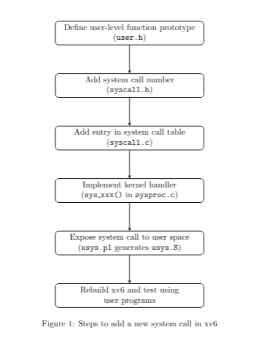

# OS-2 Programming Assignment 1 (PA-1)

**Author:** Guddeti Sreeteja

**Date:** February 2026

**Rollno:** CO24BTECH11009

---

## Introduction

This report describes Programming Assignment 1 (PA-1) of the Operating Systems II course. The main goal of this assignment was to understand how the xv6 operating system works internally by adding new system calls and testing them from user programs.

The assignment required changes to kernel files, adding system call interfaces, and testing correct behavior in normal and edge cases, including concurrent execution.

---

## Files Used

The following files were modified or used during the assignment:

- **syscall.h**: Contains system call numbers for the newly added system calls.
- **syscall.c**: Connects system call numbers to their kernel handler functions.
- **sysproc.c**: Contains the kernel implementations of the new system calls.
- **user/*.c**: User-level test programs for checking system call behavior.
- **user/user.h**: Contains user-space declarations of all system calls.
- **usys.pl**: Perl script used to generate system call stubs in `usys.S`, allowing user programs to invoke kernel system calls.
- **Makefile**: Contains build rules and paths for user-space programs and builds them using `make qemu`.

---

## Part A: Basic System Calls

### **hello**

- **Output**: A simple system call was added to print a message from the kernel.
- **Implementation**
  Used a printf statement that prints the prompt to the shell.
- **Testing**
  Called hello() 100 times in a loop to check for issues.

### **getpid2**

- **Output**: PID of the current process.
- **Implementation**: This system call returns the PID of the currently running process. The PID is obtained directly from the `pid` field of `myproc()`, which refers to the current process structure.
- **Testing**
- `Normal Test`: Called getpid2() and checked with getpid()
- `Stability Test`: Called the same getpid2() 20 times and verify each time with getpid(), we are doing this to make sure the cache is not being used for pid (so it wont use the previously stored value)
- `Child Stability Test`: The above test for children.
- `Multiple Children`: This test verifies that getpid2() returns the correct PID for each process when multiple child processes execute concurrently, ensuring the implementation does not rely on shared or global state.

---

## Part B: Process Relationships

### **getppid**

- **Output**: PID of the parent process.
- **Implementation**: This system call returns the PID of the parent process. The parent pointer of `myproc()` is accessed while holding `p->lock` to safely read the parent process structure, and the parent PID is then returned.
- **Testing**:
- `No Children Test`: Testing whether we get pid 2 when we call getppid() without forking
- `Concurrent Children Test`:

### **getnumchild**

- **Output**: Number of child processes of the current process.
- **Implementation**: The proc table, imported from `proc.h` using `extern`, is iterated over to count child processes. For each entry in the proc table, the process is checked for validity and whether its parent matches `myproc()`. The `proc_iter->lock` is acquired before accessing the state and parent pointer of the currently iterating process (`proc_iter`).

---

## Part C: System Call Accounting

### **getsyscount**

- **Output**: Total number of system calls made by the current process.
- **Implementation**: A new field named `syscount` was added to the process structure. This field is incremented in the system call handler on every system call and is returned when `getsyscount` is invoked by the calling process.

### **getchildsyscount**

**Input**: Child PID (or an identifier for the child process).
**Output**: System call count of the specified child process.
**Implementation**: This system call returns the system call count of a given child process. The proc table is searched to locate the child process with the given PID, and locks are used while accessing the child’s process structure to ensure correctness.

---

## Testing

The following user programs and test files were used to verify the correct behavior of each system call, including normal, edge, and concurrent cases:

### hello

- **File:** `hello_test.c`
  - Repeated Calls Test: Calls `hello()` 100 times in a loop to check for repeated output, kernel panics, or unexpected behavior.

### getpid2

- **File:** `getpid2_test.c`
  - Normal Test: Calls `getpid2()` and compares with `getpid()`, prints PASS/FAIL.
  - Stability Test: Calls `getpid2()` 20 times in a loop, verifying each result matches the initial value.
  - Child Test: Forks a child, child calls both `getpid()` and `getpid2()` and compares, prints PASS/FAIL.
  - Child Stability Test: Child calls `getpid2()` 20 times, verifying each result matches.
  - Multiple Children Test: Forks 5 children with staggered `pause()` delays; each child verifies `getpid()` matches `getpid2()`.

### getppid

- **File:** `getppid_test.c`
  - No Children Test: Calls `getppid()` in the main process and checks if it returns 2 (shell's PID).
  - Concurrent Children Test: Forks 5 children with staggered `pause()` delays; each child prints its PID and PPID, parent verifies forked PIDs.
  - Re-parenting Test: Forks a child, parent exits immediately, child uses `pause(10)` to wait, then checks if `getppid()` returns 1 (init process).
  - Init ppid: Checking if ppid of the init process is -1 (printing the ppid in `init.c`)

### getnumchild

- **File:** `numchild_test.c`
  - Initial Children Test: Calls `getnumchild()` before forking, expects 0.
  - After Fork Test: Forks two children (each pauses for 50 ticks), calls `getnumchild()` after each fork to verify count increments.
  - Zombie Cleanup Test: Forks a child that exits immediately, waits for it, then calls `getnumchild()` to verify zombie children are not counted.
  - Stress Test: Forks 50 children (each pauses briefly then exits), repeatedly calls `getnumchild()` during and after, verifies count returns to 0 after all children are reaped.

### getsyscount

- **File:** `getsyscount.c`
  - Increment Test: Records initial `getsyscount()`, calls `getpid2()` 100 times, then measures `getsyscount()` again. Expects increment of 101.
  - Stress Test: Runs 5 iterations; each iteration calls `getppid()` and `getpid2()` 1000 times each, verifies increment is 2001 per iteration.

### getchildsyscount

- **File:** `childsyscnt.c`
  - Valid Child Test: Forks a child that calls `getpid2()` 100 times, parent uses `pause(30)` then calls `getchildsyscount(child_pid)` and prints the count.
  - Invalid PID Test: Calls `getchildsyscount(12345)` with a non-existent PID, expects -1.
  - Self PID Test: Calls `getchildsyscount(getpid2())` passing own PID, expects -1 since self is not a child.

### Summary Table

| System Call      | Test File(s)      | Test Cases Covered                                                      |
|------------------|-------------------|-------------------------------------------------------------------------|
| hello            | hello_test.c      | Repeated calls (100x)                                                   |
| getpid2          | getpid2_test.c    | Normal, stability (20x), child, child stability, multiple children (5x) |
| getppid          | getppid_test.c    | No children, concurrent children (5x), re-parenting                     |
| getnumchild      | numchild_test.c   | Initial (0), after fork, zombie cleanup, stress test (50 children)      |
| getsyscount      | getsyscount.c     | Increment (100 calls), stress test (5 iterations × 2000 calls)          |
| getchildsyscount | childsyscnt.c     | Valid child, invalid PID, self PID                                      |

---

## Use of Existing System Calls

### **Pause**

pause system call is used in various user space test files for studying various race conditions and situations

---

## Design Decisions and Assumptions

### Design Decisions

- Direct access via `myproc()` was preferred over proc table traversal wherever possible to reduce overhead.
- The proc table was iterated only for child-related system calls such as `getnumchild` and `getchildsyscount`.
- Locks (`p->lock` and `proc_iter->lock`) were used when accessing shared process structures to ensure correctness in a multiprocessor environment.
- System call–related metadata such as `syscount` was stored in `struct proc` to maintain per-process accounting.
- Edge cases such as invalid PIDs, non-child PIDs, or missing parent processes were explicitly checked, and `-1` was returned to indicate failure.
- System call counts are maintained in the kernel to prevent user processes from modifying or spoofing the values.

### Assumptions

- `getnumchild` counts only processes that are still present in the proc table at the time of iteration. If a child exits and is freed before the scan reaches it, it will not be counted.
- `syscount` is defined as “number of completed system call entries for that process”. So any syscalls made by library code (e.g., `printf` calling `write`) are included by design.
- PIDs are allocated globally in xv6 and are not guaranteed to be continuous for a given user program. Other processes (such as the shell) may consume PIDs between successive executions, which can result in non-consecutive or patterned PID values being observed.

---

## Challenges Faced

- **Non-atomic printf**: Output from multiple processes was mixed because `printf` in xv6 is not atomic. To make output readable, `pause` was used to delay processes and reduce overlap.
- **File name length limitation**: xv6 limits file names to 14 characters (defined by `DIRSIZ`). Due to this limitation, some test programs had to be renamed with shorter file names to avoid build and execution errors.
- **Exporting the process table**: Exporting the process table required the use of the `extern` keyword. This was necessary in system calls such as `getnumchild()` and `getsyscount()`.

---

## Acknowledgements

I used official xv6 documentation, Google, and ChatGPT to understand concepts and get guidance while completing this assignment.
